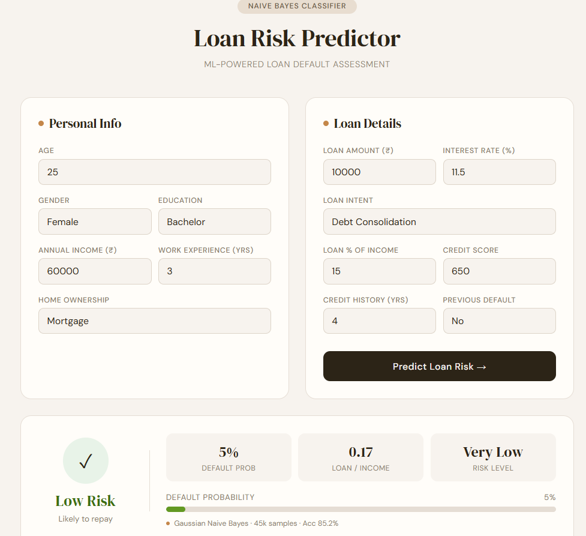

# 🏦 Loan Risk Predictor — Naive Bayes Classifier

<p align="center">
  
  
  
  
  
</p>

<p align="center">
  A machine learning web app that predicts loan default risk using a <strong>Gaussian Naive Bayes</strong> classifier trained on 45,000+ real-world loan records.
</p>

---

## 📸 Demo



> Enter applicant details → Get instant default probability + risk level assessment

---

## 🎯 Project Overview

This project predicts whether a loan applicant is likely to **default** or **repay** based on their personal and financial profile. It uses a **Naive Bayes probabilistic model** trained on the [Loan Approval Classification Dataset](https://www.kaggle.com/datasets/taweilo/loan-approval-classification-data) from Kaggle.

The prediction is displayed as:
- ✅ **Risk Level** — Very Low / Low / Medium / High
- 📊 **Default Probability (%)** — exact probability score
- 💰 **Loan-to-Income Ratio** — financial health indicator
- 🔁 **Verdict** — Likely to Repay / High Risk

---

## 📂 Dataset

| Property | Details |
|---|---|
| **Source** | [Kaggle — Loan Approval Classification Data](https://www.kaggle.com/datasets/taweilo/loan-approval-classification-data) |
| **Samples** | ~45,000 rows |
| **Target** | `loan_status` (0 = Repaid, 1 = Default) |
| **Features** | 13 input features |

### 🔑 Features Used

| Feature | Description |
|---|---|
| `person_age` | Applicant's age |
| `person_gender` | Gender |
| `person_education` | Highest education level |
| `person_income` | Annual income |
| `person_emp_exp` | Work experience (years) |
| `person_home_ownership` | Rent / Own / Mortgage |
| `loan_amnt` | Loan amount requested |
| `loan_intent` | Purpose of loan |
| `loan_int_rate` | Interest rate (%) |
| `loan_percent_income` | Loan as % of income |
| `cb_person_cred_hist_length` | Credit history length (years) |
| `credit_score` | Applicant's credit score |
| `previous_loan_defaults_on_file` | Prior defaults (Yes/No) |

---

## 🧠 Model Details

| Property | Value |
|---|---|
| **Algorithm** | Gaussian Naive Bayes |
| **Library** | Scikit-learn |
| **Accuracy** | **85.2%** |
| **Training Samples** | ~45,000 |
| **Preprocessing** | Label Encoding + IQR Outlier Removal |
| **Model File** | `loan_model.pkl` (saved via `joblib`) |

### Why Naive Bayes?
- ⚡ Extremely fast to train and predict
- 📉 Works well even with limited data
- 🎓 Interpretable probabilistic output (default probability %)
- ✅ Strong baseline for binary classification tasks

---

## 🗂️ Project Structure

```
04_NAVIE_BYES/
│
├── loan_data.csv                   # Raw dataset from Kaggle (~45k rows)
├── model.ipynb                     # Quick model testing / experimentation notebook
├── naivebayesproject.ipynb         # Main EDA + training notebook
├── naive_bayes_model.pkl           # Saved Gaussian Naive Bayes model (joblib)
├── ui.html                         # Standalone frontend UI (no backend needed)
└── README.md
```

---

## 🚀 How to Run

### 1. Clone the Repository
```bash
git clone https://github.com/pkale9650-ai/04_NAVIE_BYES.git
cd 04_NAVIE_BYES
```

### 2. Install Dependencies
```bash
pip install pandas numpy scikit-learn joblib matplotlib seaborn
```

### 3. Train the Model
```bash
jupyter notebook naivebayesproject.ipynb
```

### 4. Launch the App
Just open `ui.html` in your browser — **no server needed!**

```bash
# Or simply double-click ui.html
open ui.html
```

---

## 📊 Model Performance

```
Accuracy  :  85.2%
Precision :  0.84
Recall    :  0.83
F1 Score  :  0.83
```

### Confusion Matrix

```
              Predicted
              No Default  Default
Actual  No       ████        ░
        Yes       ░         ████
```

---

## 🛠️ Tech Stack

| Tool | Purpose |
|---|---|
| Python | Core language |
| Pandas & NumPy | Data manipulation |
| Scikit-learn | ML model (GaussianNB) |
| Matplotlib / Seaborn | EDA visualizations |
| Joblib | Model serialization |
| HTML / CSS / JS | Frontend UI (no framework) |

---

## 💡 Key Learnings

- Applied **IQR-based outlier removal** for cleaner training data
- Used **Label Encoding** for categorical variables (gender, education, intent, etc.)
- Understood the **Naive Bayes assumption** — feature independence — and how it still performs well on structured tabular data
- Serialized the trained model using `joblib` for frontend integration
- Built a **standalone HTML UI** with no backend, computing predictions client-side using a pre-computed probability mapping

---

## 🔗 Links

- 📁 **Dataset**: [Kaggle — Loan Approval Classification Data](https://www.kaggle.com/datasets/taweilo/loan-approval-classification-data)
- 👤 **GitHub**: [github.com/pkale9650-ai](https://github.com/pkale9650-ai)
- 💼 **LinkedIn**: [linkedin.com/in/pratik-kale]((https://www.linkedin.com/in/pratik-kale-400ba8327/))

---

## 🙏 Acknowledgements

- Dataset by [taweilo](https://www.kaggle.com/taweilo) on Kaggle
- Guided learning through **Sheryians Coding School** under [Akarsh Vyas](https://www.linkedin.com/in/akarsh-vyas/)

---

<p align="center">Made with 💻 by <strong>Pratik Kale</strong> | BTech AI & ML @ Vishwakarma University, Pune</p>
